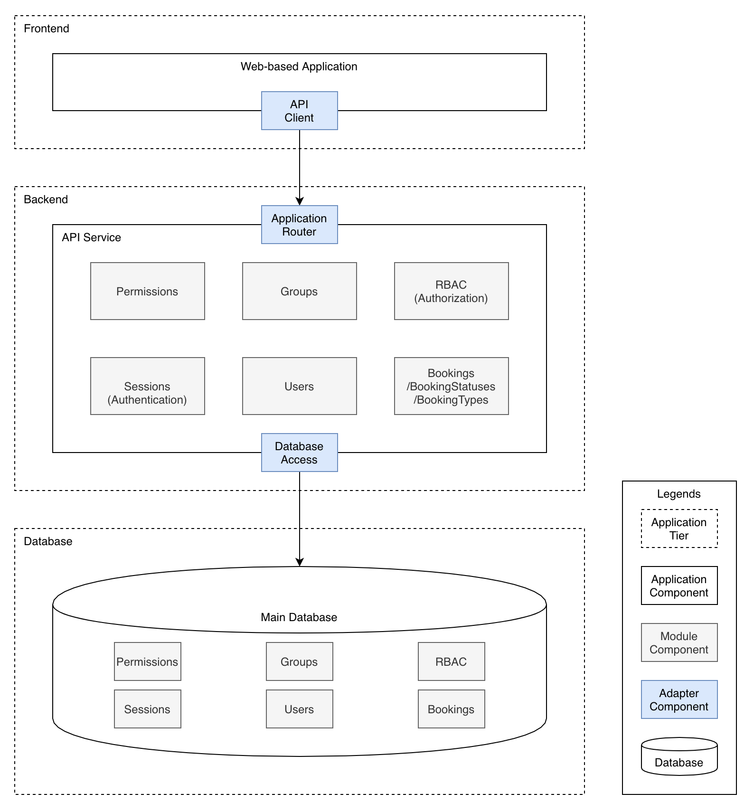

# fhg-test
Fullerton Healthcare Group Developers Technical Test

## Project Overview
Fullerton Healthcare Group is looking to build a wellness booking portal to facilitate information
transfer and booking of all activities and approval/rejection workflows.

View details at [Developers Technical Test.pdf](/docs/developers-technical-test.pdf).

## Architectural Design

## Database Design
WIP

## UI/UX Design
WIP

## Technologies
- Frontend
  - Web-based Application: React.js framework [Next.js](https://nextjs.org), global state management [Redux](https://redux.js.org), functional CSS (utility-first CSS) [TailwindCSS](https://tailwindcss.com), CSS in JS [Styled JSX](https://github.com/vercel/styled-jsx)
  - API Client: [Fetch API](https://developer.mozilla.org/en-US/docs/Web/API/Fetch_API)
- Backend
  - API Service: Node.js framework [Express.js](https://expressjs.com), object schema validation [Yup](https://github.com/jquense/yup), session-based authentication [Passport.js](http://www.passportjs.org)
  - Database Access: [Mongoose ODM](https://mongoosejs.com), [IORedis](https://github.com/luin/ioredis)
- Database
  - Main Data: [MongoDB](https://www.mongodb.com)
  - Cache: [Redis](https://redis.io)

Other tools using for local development:
- [TypeScript](https://www.typescriptlang.org)
- [ESLint](https://eslint.org)
- [Prettier](https://prettier.io)
- [Webpack](https://webpack.js.org)

## Repositories Organization
WIP

## Development & Deployment Guides
WIP

## Author
- [Phat Pham](https://github.com/phatpham9)
