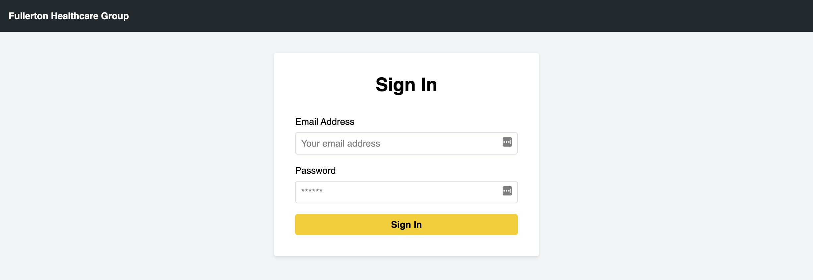
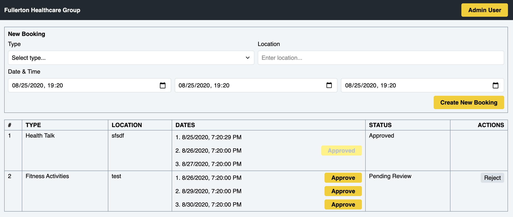

<div align="center">
  <h1>fhg-test</h1>
  <p>Project Documentations & Development Guide</p>

  <div>
    <a href="https://github.com/fhg-test/fhg-test/commits" aria-label="Commitizen Friendly">
      
    </a>
    <a href="https://github.com/fhg-test/fhg-test" aria-label="Prettier Code Style">
      
    </a>
    <a href="https://github.com/fhg-test/fhg-test/blob/master/LICENSE" aria-label="MIT License">
      
    </a>
  </div>
</div>

## Project Overview

Fullerton Healthcare Group is looking to build a wellness booking portal to facilitate information
transfer and booking of all activities and approval/rejection workflows.

More detailed information at [Developers Technical Test.pdf](/docs/developers-technical-test.pdf).

## Architectural Design


## Database Design


## UI Design

### Sign In Screen



### Bookings Dashboard



## Technologies

- Frontend
  - Web-based Application: React.js framework [Next.js](https://nextjs.org), global state management [Redux](https://redux.js.org), functional CSS (utility-first CSS) [TailwindCSS](https://tailwindcss.com), CSS in JS [Styled JSX](https://github.com/vercel/styled-jsx)
  - API Client: HTTP Request [Fetch API](https://developer.mozilla.org/en-US/docs/Web/API/Fetch_API)
- Backend
  - API Service: Node.js framework [Express.js](https://expressjs.com), object schema validation [Yup](https://github.com/jquense/yup), session-based authentication [Passport.js](http://www.passportjs.org)
  - Database Access: MongoDB ODM [Mongoose.js](https://mongoosejs.com)
- Database
  - Main Data: NoSQL Database [MongoDB](https://www.mongodb.com)

Other tools using for local development:
- [TypeScript](https://www.typescriptlang.org)
- [ESLint](https://eslint.org)
- [Prettier](https://prettier.io)
- [Webpack](https://webpack.js.org)

## Repositories Organization

- [fhg-test](https://github.com/fhg-test/fhg-test) (this repo): main repo of the project that contains documentations & development guide
- Frontend
  - [web](https://github.com/fhg-test/web): Web-based Application
- Backend
  - [api](https://github.com/fhg-test/api): API Service
- Shared Libraries
  - [core](https://github.com/fhg-test/core): Domain Entity type definitions, used in Web-based Application & API Service
  - [rest](https://github.com/fhg-test/rest): API Client, used in Web-based Application to communicate with API Service

## Development Guide

### Clone Source

Create root dir

```bash
mkdir fhg-test
```

Go to root dir and start cloning source

```bash
cd fhg-test
git clone git@github.com:fhg-test/web.git
git clone git@github.com:fhg-test/api.git
```

### Install Dependencies

```bash
cd fhg-test/web && yarn
cd fhg-test/api && yarn
```

### Start Development

Create `.env` file from `.env.example`

```bash
cp .env.example .env
```

Update environment variables in `.env` file then start the app by the following command

```bash
yarn dev
```

By default, the Web-based Application will be live at `http://localhost:3000` and API Service at `http://localhost:5000`

## Authors

[Phat Pham](https://github.com/phatpham9)

## License

[MIT](https://github.com/fhg-test/fhg-test/blob/master/LICENSE)
